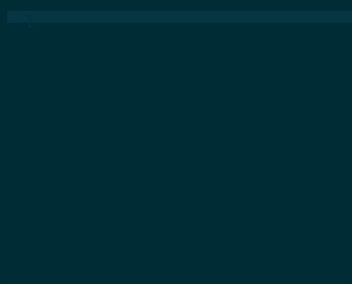

# taroSnippets

taroSnippets 是一款快速生成 taro 页面结构的用户代码片段插件

效果图:



> taroPage

```javascript
import Taro from '@tarojs/taro';
import { View, Button } from '@tarojs/components';

export default class template extends Taro.Component {
  constructor(props) {
    super(props);
  }
  componentWillMount() {}
  render() {
    return (
      <View>
        <Button>template</Button>
      </View>
    );
  }
}
```

> taroPageLess

```javascript
import Taro from '@tarojs/taro'
import { View, Text } from '@tarojs/components'
import styles from './index.module.less'

export default class Template extends Taro.Component {
  constructor (props) {
    super(props)
  }
  componentWillMount () {}
  render () {
    return (
      <View className={styles.container}>
        <Text>Template</Text>
      </View>
    )
  }
}
```